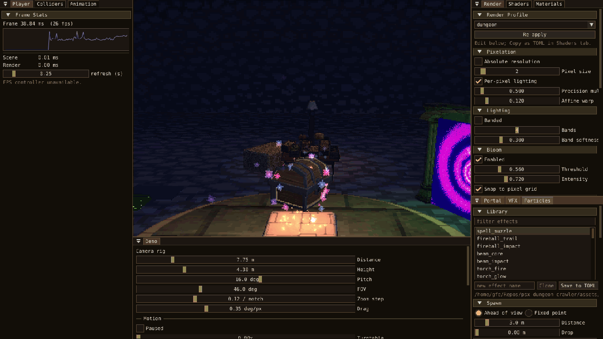
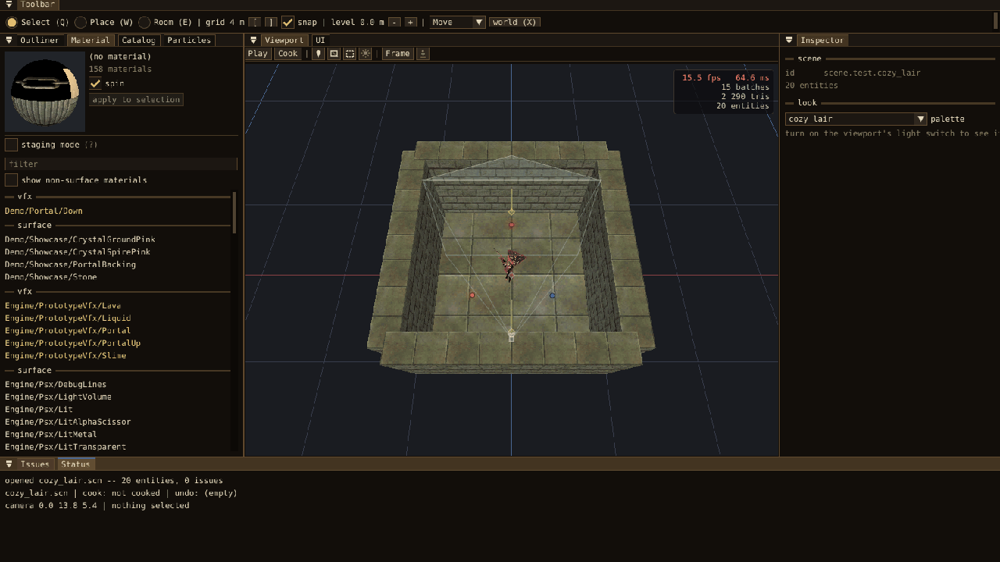

<div align="center">


<p align="center"></p>
<p align="center"></p>

# Raven Engine

**A Simple Vulkan Engine with PSX/Retro Aesthetics**

“A Raven is a symbol of resolve. The will to choose what one fights for.”

[](LICENSE)

</div>

## Core

- Vulkan 1.3 renderer
- Low-resolution internal rendering
- Vertex snapping and affine-style texture warping
- Dithering, color quantization, fog and palette control
- ECS scene and gameplay layer
- Jolt physics
- Seeded generation and reproducible captures
- Scene editor, material tools and immediate playtesting
- Debug UI, profiling and RenderDoc capture support

## Footage

<p align="center"></p>

<p align="center"></p>

<p align="center"></p>

<p align="center"></p>

<p align="center"></p>

<p align="center"></p>


## Build

```sh
make deps
make run
```

The first build compiles the dependencies, so it will take longer than later builds.

```sh
make editor SCENE=path/to/scene.scn  # edit, then press F5 to playtest
make editor                          # run default scene
make scene SCENE=path/to/scene.scn   # cook and run a scene
make prefab-viewer PREFAB=prefab     # inspect a model
make demo                            # run the renderer demo
make test                            # run the test suite
make help                            # show every target and option
```

## Different Profiles:

```sh
make run PRESET=ps1
make run PRESET=n64
make run PRESET=pixel-3d
make run PRESET=modern-ps1
```

## Content Pipeline

```text
  .scn    source
    |
    x     scene cooker
    |
    v
  .map    runtime data
    |
    v
  game
```

## License

Released under the [GNU GPL v3](LICENSE).
