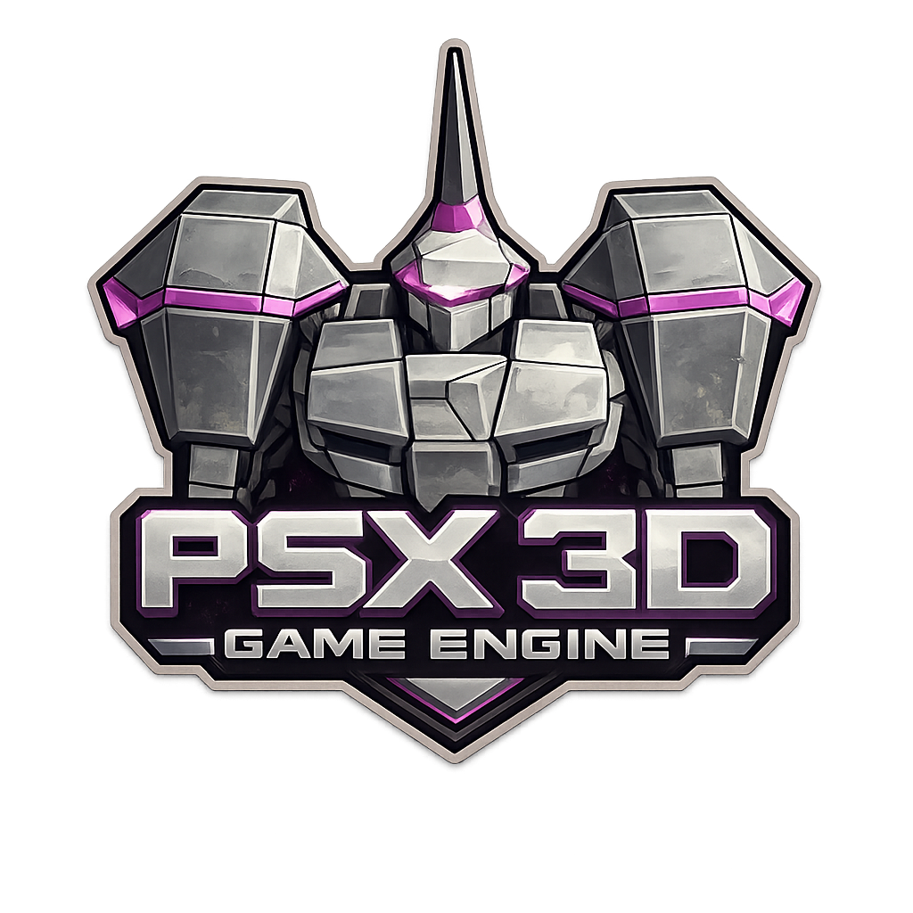

<div align="center">



# psx-dungeon-crawler

**First-person PSX-style dungeon crawler. Plus C++20 engine written to run it.**

[](https://en.cppreference.com/w/cpp/20)
[](https://www.ogre3d.org/)
[](https://github.com/jrouwe/JoltPhysics)
[](https://github.com/skypjack/entt)
[](https://cmake.org/)
[](LICENSE)

</div>

## Samples


## Quick start

```sh
make deps      # toolchain + SDL2 + glm + OGRE, first build is slow
make run       # build and play
make help      # full target and option reference
```

## Targets

```sh
make run                 # the game
make editor SCENE=x.scn  # placement editor, F5 to playtest
                         #   entities & components: docs/scene-editor-entities.md
make cook SCENE=x.scn    # .scn -> .map, same cooker CI uses
make scene SCENE=x.scn   # cook and play it; a scene with a camera plays as a
                         #   shot: docs/authoring-shots.md
make demo                # shader sample, see docs/psx-demo.md
make sim                 # headless combat/physics harness
make test                # ctest suite
```

## Command line

```sh
./game level.map                    # play a cooked map
./game --scene portal               # portal showcase pose, sim frozen
./game --render-preset ps1          # era:   ps1 ps2 gamecube n64
                                    # style: pixel-3d modern-ps1 dungeon
                                    # mood:  psx-horror fire-dimension poison-swamp
./game --record clip.gif --record-frames 60 --record-fps 20 \
       --record-start 120 --record-width 480
```

- `--record` also takes `--record-loops`, `--record-frame-dir`,
  `--record-keep-frames`. Needs `ffmpeg`.
- Recording pins the frame delta to `1/fps`. Clip is reproducible.
- Preset precedence: `--render-preset` > `PSX_RENDER_PRESET` > `dungeon`.
- What each profile emulates, and how to add one: [`docs/render-presets.md`](docs/render-presets.md).

## Environment

| Variable | What it does | `make` |
|---|---|---|
| `PSX_GEN_SEED` | world seed | `SEED=` |
| `PSX_RENDER_PRESET` | starting render preset | `PRESET=` |
| `PSX_SHOWROOM_MAP` | override the depth-zero showroom TOML | `SHOWROOM=` |
| `PSX_SCREENSHOT` / `PSX_SCREENSHOT_FRAME` | write a PNG at frame N, exit | `SHOT=` / `FRAME=` |
| `PSX_BENCH_FRAMES` | frame-time percentiles, exit | `BENCH=` |
| `PSX_FIXED_DT` | fixed frame delta, no capture | `FIXED_DT=` |
| `PSX_SHOW_COLLIDERS` / `PSX_WIREFRAME` | debug overlays | `COLLIDERS=` / `WIREFRAME=` |
| `PSX_PROFILE` | per-phase frame timings | `PROFILE=` |
| `PSX_GEN_DUMP=<seed>` | print that seed's grid, exit | |
| `PSX_DEBUG_UI` / `PSX_FULLSCREEN` | tuning panel open / fullscreen | |
| `PSX_CONSOLE` | dev console open on frame 1 | |
| `PSX_IMGUI_THEME` | imgui theme id (`dougbinks_dark`, `one_dark`, `dark`, `light`, `classic`) | |

## Keys

| Key | Action |
|---|---|
| `F1` `F2` `F3` `F4` `F5` | tuning panel, wireframe, colliders, frame times, playtest |
| `` ` `` | dev console (log + commands) |
| `WASD` `Space` `Shift` `Ctrl` `C` | move, jump, sprint, crouch, slide |
| `E` | interact |
| `Mouse 1` | fire selected magical weapon |
| `1` `2` `3` `X` | select weapon, or cycle weapon |
| `B` `V` `G` | dodge, deflect, kick |
| | rebind in `assets/config/game.toml` |

## Recipes

```sh
# deterministic capture, same pixels run to run
make screenshot SHOT=/tmp/shot.png FRAME=200

# reproduce a dungeon
PSX_GEN_DUMP=42 ./game && make run SEED=42

# iterate a layout without rebuilding
make run SHOWROOM=/tmp/showroom.toml

# frame cost, first 60 frames dropped as warm-up
make bench BENCH=300

# GPU and native debugging, APP=game|scene_editor|psx_demo
make renderdoc APP=game FRAME=200
make gdb APP=game BATCH=1
make perf APP=game BENCH=600
```

See [`docs/debugging-renderdoc.md`](docs/debugging-renderdoc.md).

## Content

```
   .scn  (JSON, authored, committed)
     |
     |   scene_cook  ->  the ONE cooker; editor calls same function
     v
   .map  (binary, derived, never edited by hand)
     |
     v
   game <level>.map
```

## Rules

1. Third-party libraries never leak. Game code includes `eng/*.h` and GLM.
2. EnTT registry is truth. Renderer is a view.
3. Content is TOML and components, not hardcoded.
4. Fixed-step sim, pinnable RNG, reproducible captures.
5. The image is frozen. `make visual-test` proves it.
