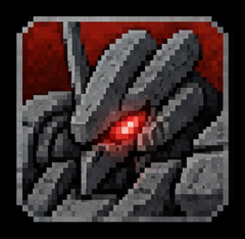
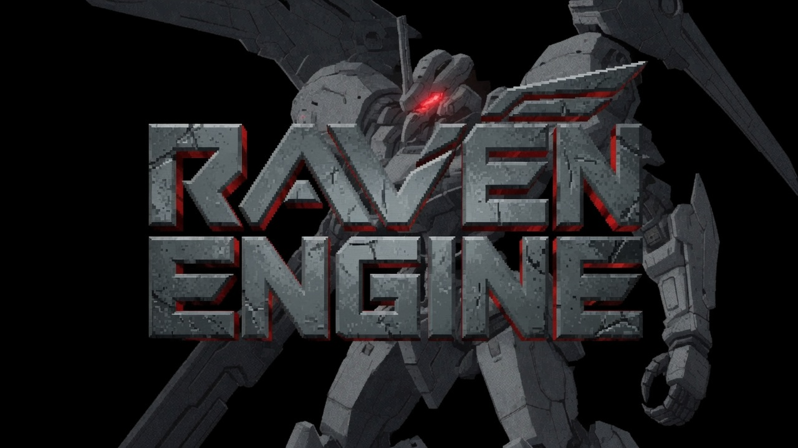
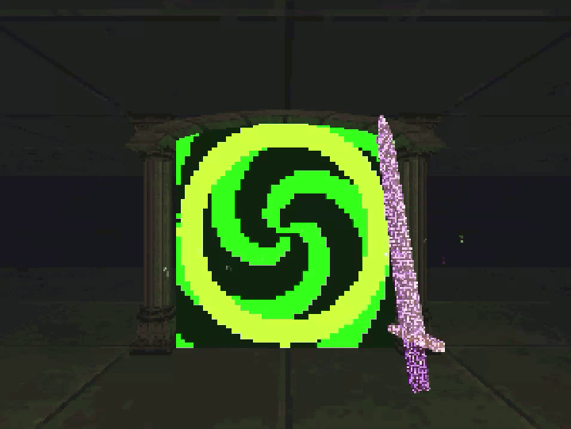
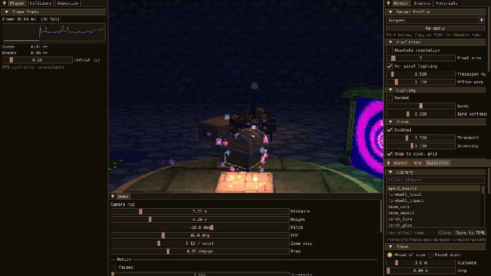
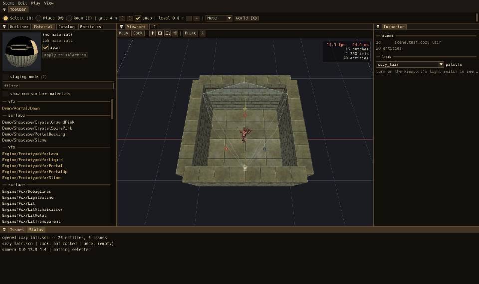

<div align="center">

<p align="center"></p>
<p align="center"></p>


# Raven Engine

**A Simple Vulkan Engine with PSX/Retro Aesthetics**


## Lore

**Armored Core 6 spoilers alert!**

In Armored Core 6, everyone has their own individual callsign. We coincidentally stumble upon a 'Raven' callsign at the start. Cute homage right?

We are given hints after however, that there's more to the Raven callsign that we realized. In fact, it seems like Raven is who leaked that coral existed on Rubicon in the first place.

Then, we are suddenly ambushed by the badass 'Nightfall'. The 'original' Raven that we stole the callsign from. Their operator taunts us, and says how they don't want the it back and just want to see if we are even good enough to be a Raven...

After defeating 'Nightfall' it's explained how 'Raven' isn't a single call sign. There is a group called 'Branch' that is a rotating door of elite mercenaries, and anyone in there is a 'Raven'. It's a title, not a person. It's a symbol of someone that is truly free, not a corporate dog.

Basically, the Raven's Branch is the opposite of the Raven's Nest. Freedom vs Control.

In the most simple of meta terms, being THE Raven means being THE Protagonist. And instead of the game just freely giving you that role, you have to earn it. The story mirrors this. Where you start out only helping the corporate wars, but end up choosing how you will 'save' the world on your own.

</div>

## Core

- Vulkan 1.3 renderer
- Low-resolution internal rendering
- Vertex snapping and affine-style texture warping
- Dithering, color quantization, fog and palette control
- ECS scene and gameplay layer
- Jolt physics
- Seeded generation and reproducible captures
- Scene editor, material tools and immediate playtesting
- Debug UI, profiling and RenderDoc capture support

## Footage

<p align="center"></p>

<p align="center"></p>

<p align="center"></p>

<p align="center"></p>

<p align="center"></p>

<p align="center"></p>


## Build

```sh
make deps
make run
```

The first build compiles the dependencies, so it will take longer than later builds.

```sh
make editor SCENE=path/to/scene.scn  # edit, then press F5 to playtest
make editor                          # run default scene
make scene SCENE=path/to/scene.scn   # cook and run a scene
make prefab-viewer PREFAB=prefab     # inspect a model
make demo                            # run the renderer demo
make test                            # run the test suite
make help                            # show every target and option
```

## Different Profiles:

```sh
make run PRESET=ps1
make run PRESET=n64
make run PRESET=pixel-3d
make run PRESET=modern-ps1
```

## Content Pipeline

```text
  .scn    source
    |
    x     scene cooker
    |
    v
  .map    runtime data
    |
    v
  game
```

## License

Released under the [GNU GPL v3](LICENSE).
